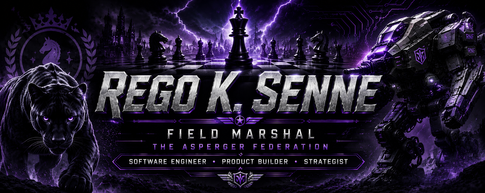
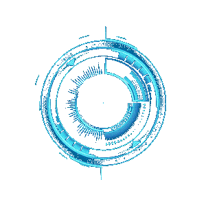

<p align="center">
  
</p>

<p align="center">
  
</p>

<div align="center">

# ⚔ REGO K. SENNE

### Field Marshal of the Asperger Federation

*Software Engineer • Product Builder • Strategist*

</div>

---

<div align="center">

## 📜 Character Sheet

* **Name:** Regomoditswe "Rego" Senne
* **Class:** Software Engineer
* **Subclass:** Product Builder
* **Faction:** Rise & Forge
* **Current Base:** South Africa 🇿🇦
* **Level:** 27
* **Next Evolution:** Loading...

</div>

---

<div align="center">

## 🛰 Status

**Alignment:** Chaotic Productive
**Current Objective:** Forge systems worth remembering
**Current Threat:** Comfort

</div>

---

<div align="center">

## 📊 Attributes

```text
Strategy      ██████████
Curiosity     ██████████
Discipline    ████████░░
Coding        ████████░░
Design        ███████░░░
Leadership    ██████░░░░
```

</div>

---

<div align="center">

## ⚔ Tech Arsenal


</div>

---

<div align="center">

## 🚧 Current Build

### RNF — Rise & Forge

A personal development platform focused on habits, discipline, progression, and self-mastery.

</div>

---

<div align="center">

## 🎯 Active Quests

 * [ ] Learn Go
 * [ ] Build RNF
 * [ ] Master Java & Spring
 * [ ] Learn System Design
 * [ ] Earn AWS Certifications
 * [ ] Reach 2600+ Chess Rating

</div>

---

<div align="center">

## 📜 Character Lore

Chess player.
Engineer.
Builder.

Obsessed with understanding systems, whether they exist in software, business, or the human mind.

Currently forging software, ideas, and a future worth remembering.

</div>

---

<div align="center">

## ⚡ Motto

*"Build like an engineer. Think like a strategist. Move like a founder."*

</div>
